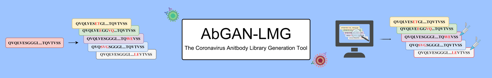

# The Coronavirus Antibody Library Generation Tool: AbGAN-LMG

## Introduction

AbGAN-LMG, an innovative tool for generating coronavirus antibody libraries, harnesses the power of deep learning techniques by utilizing the CoV-AbDab 
coronavirus antibody database as training data. By combining the representational capabilities of language models with the generative potential of 
generative adversarial networks, this tool facilitates the creation of antibody sequence libraries from user-provided antibody sequences, ensuring 
improved developability of the generated antibodies. Moreover, AbGAN-LMG enables in silico assessments of developability for the generated antibody 
libraries and recommends a subset of antibodies with favorable developability for experimental validation.The AbGAN-LMG website is freely accessible 
at http://39.102.71.224:88/.
AbGAN-LMG was created by the Information Center of Academy of Military Medical Sciences.

## Features

- **Antibody Library Generation**: Quickly generate antibody sequences targeting wild type coronavirus antibody heavy chain sequence.

- **Developability Calculation**: You can use the function on the web sever(accessible at http://39.102.71.224:88/.), if you need this code please contact us.

## Installation

To use this tool, follow these installation steps:

1. Clone the repository:
git clone https://github.com/Zhaowenbin98/AbGAN-LMG.git

2. Install the required dependencies:
pip install -r requirements.txt / conda env create -f environment.yml

3. Run the tool:
a. python AbGAN_LMG_Trainer.py *Train Your Model
b. python Antibody_Library_Generation.py *Antibody Library Generation for wild type coronavirus antibody heavy chain sequence(single antibody sequence).
c. python Antibody_Library_fasta_Generation.py *Antibody Library Generation for wild type coronavirus antibody heavy chain sequence library(multiple antibody sequences).

## Train Your Model

1. Launch the tool by running `AbGAN_LMG_Trainer.py --model_select (chose_language_model)  --train_dataset_save_path  (your_train_dataset_path) --val_dataset_save_path (your_val_dataset_path)`.

2. Monitor the training progress, which will provide updates on various metrics and loss values. You can adjust the training parameters(Learning-rate, Train-step, Temperature, etc) as needed during this phase to optimize model performance.

3. Once the training is complete, the trained model and associated weights will be saved to the specified directory `./Model_Save`.

4. You can then proceed to utilize the trained model for antibody sequence generation and optimization using the provided tools and interfaces.

## Antibody Library Generation (single antibody sequence)

1. You need to go [here](http://39.102.71.224:88/download_languagemodel) to download the language models used to train the models and unzip them into the./Model folder.

2. Launch the tool by running `Antibody_Library_Generation.py  --target_sequences_VH (heavy_chian_sequence) --target_sequences_VL (light_chian_sequence)  --generate_num 2000 --top_num 100`.

3. Once the generation is complete, the generated antibody seuqences library will be saved to the specified directory `./Result`.

4. If you need to compute the developability of the generated antibody sequence library locally, please contact us.

## Antibody Library Generation (multiple antibody sequences)

1. Launch the tool by running `Antibody_Library_Generation.py --target_library_path (your_library_fasta) --generate_num 2000 --top_num 100`.

2. Once the generation is complete, the generated antibody seuqences library will be saved to the specified directory `./Result`.

3. If you need to compute the developability of the generated antibody sequence library locally, please contact us.

## Contact Us

If you have any questions, suggestions, or need assistance, please contact our team at [zwb3585@163.com](mailto:zwb3585@163.com).

## Acknowledgments

AbGAN-LMG is based on antibody repertoires from the CoV-AbDab database.IgFold is used for 3D structural modeling of antibodies. 
Developability Calculation: Solubility is calculated using CamSol, humanness is calculated using BioPhi, ease of aggregation is 
calculated using Aggrescan3D, and immunogenicity is calculated using NetMHC-3.0.

---

**Disclaimer:** This tool is intended for research and educational purposes only. It should not be used as a substitute for 
professional medical or scientific advice.

